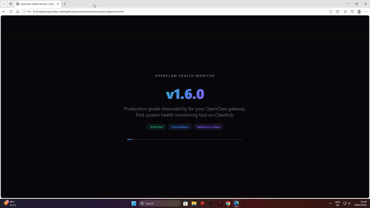
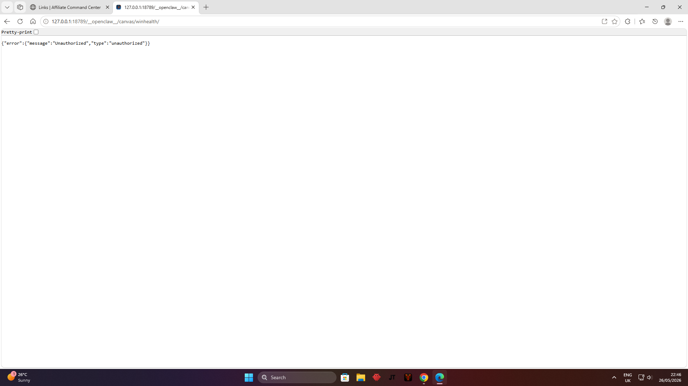
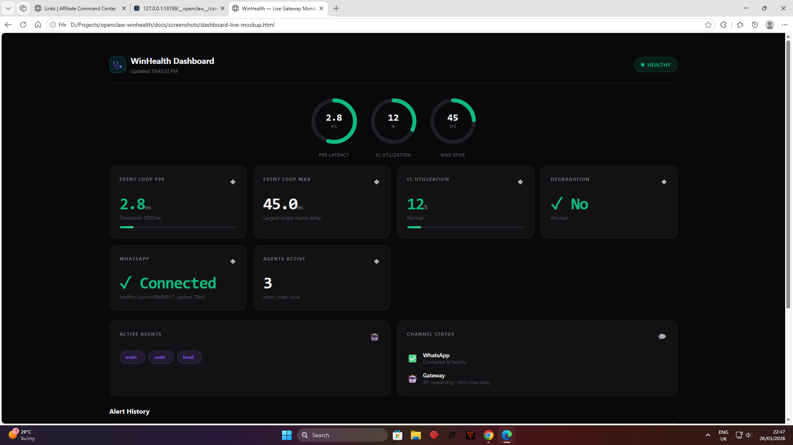

# OpenClaw Cross-Platform Health Monitor 🩺

> Diagnose and fix OpenClaw gateway issues. Background health polling, multi-channel alerts, event loop monitoring, and automated diagnostics. Works on Windows, Linux, and macOS.

[](LICENSE)
[](https://github.com/jordan-thirkle/openclaw-winhealth/actions)
[](#)
[](https://openclaw.ai)
[](https://github.com/jordan-thirkle/openclaw-winhealth/releases)
[](CONTRIBUTING.md)
[](https://github.com/jordan-thirkle/openclaw-winhealth/releases)

## Demo

<p align="center">
  <a href="https://github.com/jordan-thirkle/openclaw-winhealth/releases/tag/v1.6.0">
    
  </a>
  <br>
  <em>AI-narrated showcase walkthrough covering all v1.6.0 features, security fixes, and cross-platform parity.</em>
  <br>
  <strong>Watch the full video:</strong> <a href="https://youtube.com/@JordanThirkle">YouTube</a> · <a href="https://github.com/jordan-thirkle/openclaw-winhealth/releases/tag/v1.6.0">GitHub Releases</a>
</p>

### Screenshots

<p align="center">
  <strong>Dashboard Auth</strong> — localStorage + plain HTTP warnings<br>
  
</p>

<p align="center">
  <strong>Live Dashboard</strong> — Gauges, metrics, agents, alerts<br>
  
</p>

### Recording Your Own Demo

```powershell
# Generate AI narration audio (Windows TTS)
.\docs\screenshots\generate-narration.ps1

# Record screen + narration
.\docs\screenshots\produce-video.ps1
```

| Tool | Use case |
|------|----------|
| **FFmpeg** | Screen recording + audio overlay (`produce-video.ps1`) |
| **PowerShell TTS** | AI voice narration generation (`generate-narration.ps1`) |
| **OBS Studio** | Advanced scene composition |
| **ShareX** | Quick screenshots + GIF recording |

## Privacy & Security

This plugin monitors your gateway's operational health. **By default in v1.4.0, no data leaves your machine.**

- **Monitoring probes** are read-only — they check `http://127.0.0.1:18789` without modifying gateway state
- **Diagnostic bundles** are local files created only when you run `winhealth_diagnostics` or `openclaw gateway diagnostics export`. These may contain system metadata — review before sharing
- **Log tail extraction** (`winhealth_diagnostics --include_logs true`) reads recent gateway log messages. Logs may contain file paths, identifiers, or operational metadata — use with caution
- **External alerts** (WhatsApp/Telegram) are **off by default** (`alertChannel: "none"`). You must explicitly opt in and understand what alert payloads contain
- **Alert payloads** contain only: severity level, metric value, and recommended action. No API keys, conversations, or configuration data
- **Gateway token** is read from your environment for local health probes only — never logged, persisted, or transmitted

Read the full disclosure: **[SECURITY.md](./SECURITY.md)** | [SkillSpector Audit](https://clawhub.ai/plugins/@jordan-thirkle/openclaw-winhealth/security-audit)

---

## Why This Exists

OpenClaw gateways can experience performance regressions across all platforms. After extensive debugging of the 2026.5.22 performance regression (event loop blocking, CLI tool slowness, prewarm bottlenecks), I built this to automatically detect and diagnose these issues across Windows, Linux, and macOS.

**First system health monitoring tool on ClawHub.** 27 automated tests with CI/CD pipeline.

## Features

### 🔍 Health Checks
- **Gateway health snapshot** — event loop (p99, max, utilization), channel status, memory
- **Windows Scheduled Task** — state, last result, last run time
- **Prewarm detection** — identifies 2026.5.22+ provider auth prewarm blocking (30-79s stalls)
- **Stuck subagent detection** — finds background subagents blocking gateway restart
- **CLI vs HTTP delta** — the key discovery: CLI tool can be 20-30x slower than HTTP endpoint on Windows

### 🚨 Alerts
- WhatsApp and Telegram alerts when thresholds breach **(off by default — requires explicit opt-in)**
- Configurable thresholds (event loop p99, memory RSS)
- Alert management (list, dismiss, clear)
- Optional auto-diagnose on alerts (off by default — see [SECURITY.md](./SECURITY.md))

### 🩺 Diagnostics
- Full diagnostic bundle export (`openclaw gateway diagnostics export`) — **review output before sharing**
- Recent log tail extraction (disabled by default — enable with `include_logs: true`)
- Channel health probe
- Gateway status summary

### 📊 Background Monitoring
- Periodic health polling (configurable, default 5 minutes)
- Automatic alert generation on degradation
- Non-blocking — uses `gateway_start` lifecycle hook
- Zero-dependency core (uses OpenClaw SDK only)

## Installation

### Prerequisites

- OpenClaw ≥ 2026.5.0
- Node.js ≥ 22.19
- Windows 10/11, Linux, or macOS

### Install the Plugin

```bash
openclaw plugins install clawhub:@jordan-thirkle/openclaw-winhealth
```

### Install the Skill

```bash
openclaw skills install windows-health-monitor
```

Restart the gateway to load the plugin:

```bash
openclaw gateway restart
```

### Post-Install Verification

After installation and restart, confirm the plugin is active:

```bash
# 1. Verify the plugin is registered
openclaw plugins inspect winhealth --runtime --json

# 2. Check the gateway log for startup
openclaw gateway logs --tail 20 | grep "winhealth"

# Expected output: "winhealth: started, polling every 5m"
# Expected output: "winhealth: health check passed" (after ~60s initial delay)

# 3. Run a manual health check
openclaw run winhealth_check --json

# Expected output: JSON with eventLoop, channels, agents, etc.
```

### Uninstall

```bash
# Remove the plugin
openclaw plugins remove winhealth

# Remove the skill
openclaw skills remove windows-health-monitor

# Restart the gateway
openclaw gateway restart
```

## Configuration

Add to your `openclaw.json`:

```json5
// Minimal config — local monitoring only, no external transmission:
{
  "plugins": {
    "allow": ["winhealth"],
    "entries": {
      "winhealth": {
        "enabled": true,
        "config": {
          "pollIntervalMinutes": 5,
          "eventLoopThresholdMs": 5000,
          "alertChannel": "none",
          "alertTarget": "+15555550123",
          "checkPrewarm": true,
          "checkWindowsTask": true,
          "checkBackgroundSubagents": true
        }
      }
    }
  }
}
```

See [SECURITY.md](./SECURITY.md) before enabling external alert channels.

### Config Reference

| Field | Type | Default | Description |
|---|---|---|---|
| `enabled` | boolean | `true` | Enable/disable background monitoring |
| `pollIntervalMinutes` | integer | `5` | Minutes between health checks (1-60) |
| `eventLoopThresholdMs` | integer | `5000` | Event loop p99 threshold for alert (500-30000) |
| `alertChannel` | string | `"none"` | Alert channel: "whatsapp", "telegram", or "none" (off by default — see SECURITY.md) |
| `alertTarget` | string | `""` | Target for alerts (phone number or user ID). Only used when alertChannel is not "none" |
| `checkPrewarm` | boolean | `true` | Check for provider auth prewarm blocking |
| `checkWindowsTask` | boolean | `true` | Check Windows Scheduled Task health |
| `checkBackgroundSubagents` | boolean | `true` | Check for stuck background subagents |

## Usage

### Agent Tools

Once the plugin is loaded, agents can use three tools:

| Tool | Purpose |
|---|---|
| `winhealth_check` | Quick health snapshot — event loop, channels, Windows task, prewarm, alerts |
| `winhealth_diagnostics` | Full diagnostic bundle — export, logs, status, channels |
| `winhealth_alerts` | Manage alerts — list, dismiss, clear |

Ask your agent:

> "Run a winhealth_check and tell me if anything is wrong."

> "Run winhealth_diagnostics and summarize the findings."

> "Show me active winhealth alerts."

### Manual CLI

The skill also provides manual diagnostic commands:

```bash
# Quick health snapshot
openclaw health --verbose --json

# Channel status
openclaw channels status --probe

# Windows task
Get-ScheduledTask -TaskName "OpenClaw Gateway"

# Full diagnostic export
openclaw gateway diagnostics export
```

### Web Dashboard

The plugin includes a live health dashboard with radial gauges, metrics cards, and alert history.

**Prerequisites:**
- The [canvas](https://clawhub.ai) plugin must be installed and enabled in your OpenClaw config
- Canvas host root configured (e.g., `"host": { "root": "~/.openclaw/workspace/canvas" }`)

**Setup:**
```bash
# Clone the repo to get the dashboard files
git clone https://github.com/jordan-thirkle/openclaw-winhealth.git
# Copy the WinHealth dashboard to your canvas host root
cp openclaw-winhealth/dashboard/index.html ~/.openclaw/workspace/canvas/winhealth/index.html
# Copy the Command Center dashboard (optional)
cp openclaw-winhealth/dashboard/command.html ~/.openclaw/workspace/canvas/command/index.html
```

**Access:**
- WinHealth Dashboard: `http://127.0.0.1:18789/__openclaw__/canvas/winhealth/`
- Command Center: `http://127.0.0.1:18789/__openclaw__/canvas/command/`

The dashboard uses **sessionStorage** by default — your gateway token is cleared when you close the tab. Enable "Remember token" to persist it across sessions. See [SECURITY.md](./SECURITY.md) for dashboard security details.

## Alert Examples

### Event Loop Degradation
```
⚠️ OpenClaw Health Alert
[CRITICAL] Event loop degraded: p99=8500ms (threshold 5000ms)

Consider: OPENCLAW_SKIP_PROVIDER_AUTH_PREWARM=1
```

### Stuck Subagents
```
⚠️ OpenClaw Health Alert
[CRITICAL] 4 background subagent(s) blocking gateway restart
```

### Prewarm Detection
```
⚠️ OpenClaw Health Alert
[WARNING] Provider auth prewarm slow: 68000ms. Consider OPENCLAW_SKIP_PROVIDER_AUTH_PREWARM=1
```

## Known Issues This Detects

| Issue | Detection |
|---|---|
| **2026.5.22 prewarm blocking** | Log check for `provider auth state pre-warmed in Xms eventLoopMax=Yms` |
| **CLI tool slowness** | Health via HTTP vs CLI response time delta |
| **Stuck background subagents** | Log check for `restart.*deferred.*background task.*active` |
| **WhatsApp reconnection storm** | Channel health probe + connection age |
| **Scheduled Task stall** | `Get-ScheduledTask` state check |
| **Memory pressure** | RSS threshold monitoring |
| **Event loop saturation** | p99 delay + utilization monitoring |

## Architecture

```
Gateway Startup
  │
  └─ gateway_start hook
       │
       ├─ Initial health check (60s grace)
       └─ setInterval (configurable, default 5m)
            │
            ├─ HTTP health probe (127.0.0.1:18789/health)
            ├─ Windows task check (Get-ScheduledTask)
            ├─ Prewarm detection (log grep)
            ├─ Stuck subagent detection (log grep)
            │
             ├─ Threshold evaluation
             └─ Alert routing (WhatsApp / Telegram)
```

## Development

```bash
git clone https://github.com/jordan-thirkle/openclaw-winhealth.git
cd openclaw-winhealth
npm install

# Test locally
openclaw plugins install .
openclaw plugins inspect winhealth --runtime --json
```

### Publish to ClawHub

```bash
# Dry run
npm run publish:clawhub:dry

# Publish
npm run publish:clawhub
```

## Contributing

Issues and PRs welcome. Before submitting:
1. Test on Windows 10/11 native
2. Run `openclaw plugins inspect winhealth --runtime --json`
3. Include reproduction steps for any issues

## Related Projects

- [OpenClaw-Viz PR #3](https://github.com/sltogethertao-sudo/openclaw-viz/pull/3) — Fix calver compatibility
- [OpenClaw Issue #85999](https://github.com/openclaw/openclaw/issues/85999) — Prewarm event loop blocking

## License

MIT © Jordan Thirkle
